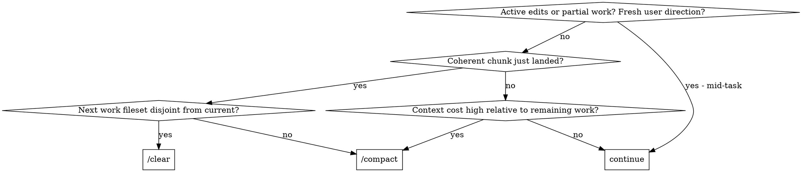
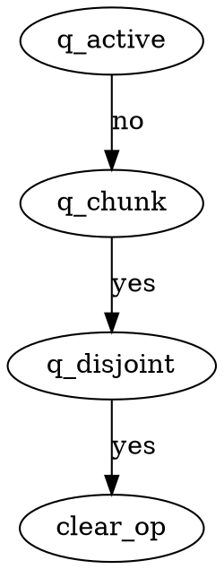

Produce a structured context-management recommendation. Use at phase boundaries, after long agent runs or research chunks, or any time context cost (latency, dollars, attention) outpaces value.

## Inputs

- Parent conversation: recent tool turns, in-flight task state, working-tree state.
- Optional skill argument: caller-provided summary, override, or path to a plan document.

## Locating the plan

Resolve the plan document in this priority order:

1. Skill argument, if it resolves to an existing file.
2. Plan path named in a recent `ExitPlanMode` tool result, if one is in conversation history.
3. `ls -t ~/.claude/plans/*.md 2>/dev/null | head -1` is currently !`ls -t ~/.claude/plans/*.md 2>/dev/null | head -1`. Re-run if a new plan was created mid-session.

If none resolves to an existing file, skip Phase-contract reasoning. See the Decision tree section below for how the diamonds get answered without a plan.

## Decision tree

Phase contracts, when present, sharpen the answers to `q_chunk` (postconditions met → yes) and `q_disjoint` (compare current Phase's in-scope fileset to the next Phase's). Without contracts, fall back to general signals: a long agent run just landed, a research thread just crystallized into a decision, the upcoming files are clearly disjoint from the recent ones.

Treat `q_heavy` as yes when context window usage is past ~60%, response latency is dragging, or more than ~30 tool turns have accumulated since the last `/clear`. The tree is asymmetric on purpose: once a chunk has landed, `q_disjoint` alone decides between `/clear` and `/compact` — disjoint-next-fileset dominates heaviness in that branch.

## Output

Two parts: a `dot` traversal block (path actually taken through the decision tree above), then a paste-ready payload conditional on the leaf.

### Traversal

Include only the diamonds reached and the leaf box. Match node names to the decision tree so the path is checkable. Example for `/clear` reached via no-active-work + chunk-landed + disjoint-next-fileset:

### Paste-ready payload

- **`/compact`** → fenced block with free-form prose, paste-ready as the `/compact` argument:

      Keep <files relevant to next chunk>, <decisions or contracts to preserve>, and <plan-doc path if any>. Drop <items dropped>.

- **`/clear`** → fenced block paste-ready as the first message in the post-`/clear` context. Omit the Plan line when no plan exists:

      Resuming <task or plan name>.

      Plan: <plan-doc-path>
      In-scope files: <list>
      Recent decisions: <list>
      Next: <next task or step>

- **`continue`** → no fenced block; a one-paragraph note naming the active work or signal that argues against yielding.

## Keep

Files relevant to the next chunk. Decisions and contracts. Plan document if one exists. Recent direct user input.

## Drop

Work whose results have landed in files — the diff is the artifact. Research already distilled into the plan or a decision. Long agent run outputs whose conclusions are captured elsewhere; a 40-turn Explore that resolved to three files and a function name should leave the conclusion in the plan and drop the trace. Stale exploratory tool runs.
