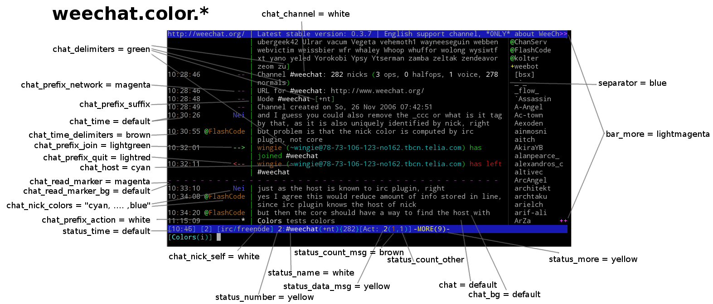

# weechat

## Colors
### 16-color Terminal Palette
* 0,  1: background (black, gray)
* 1,  9: red
* 2, 10: green
* 3, at.color.chat_prefix_buffer1: yellow
* 4, 12: blue
* 5, 13: magenta
* 6, 14: cyan
* 7, 15: light gray

### What's What

*thanks to pu in #weechat on Freenode*
